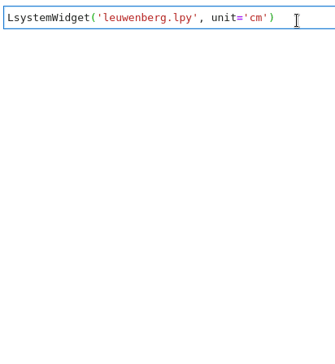

# pgljupyter

[PlantGL](https://github.com/fredboudon/plantgl) & [L-Py](https://github.com/fredboudon/lpy) jupyter widgets





[](https://zenodo.org/badge/latestdoi/252633303)

## Quick Examples

### PlantGL

- simple PlantGL shapes - spheres [@nbviewer](https://nbviewer.jupyter.org/github/jvail/plantgl-jupyter/blob/master/examples/spheres.ipynb)

### L-Py

- a tree model - leuwenberg [@nbviewer](https://nbviewer.jupyter.org/github/jvail/plantgl-jupyter/blob/master/examples/lpy/leuwenberg/leuwenberg.ipynb)

- plot magic - leuwenberg [@nbviewer](https://nbviewer.jupyter.org/github/jvail/plantgl-jupyter/blob/master/examples/lpy/leuwenberg/lpy_plot_magic.ipynb)

- champignon [@nbviewer](https://nbviewer.jupyter.org/github/jvail/plantgl-jupyter/blob/master/examples/magic_champignon.ipynb)

- magics with scalar parameters - broccoli [@nbviewer](https://nbviewer.jupyter.org/github/jvail/plantgl-jupyter/blob/master/examples/broccoli.ipynb)

- magics with curve parameters - sweep surface [@nbviewer](https://nbviewer.jupyter.org/github/jvail/plantgl-jupyter/blob/master/examples/lpy/sweep_surface/sweep_surface.ipynb)


## Usage

```python
from pgljupyter import SceneWidget, LsystemWidget
```

**SceneWidget**

Renderer for PlantGL Scenes, Shapes, Geometries

Arguments:

- `arg0` list | plantgl.Shape | plantgl.Scene: a list of shapes or scenes or a single object
- `position` tuple (float, float, float): x, y, z position of arg0 (default (0, 0, 0))
- `scale` float: scale factor for arg0 (default 1)
- `size_display` tuple (int, int): width and height of the canvas (minimum 400)
- `size_world` float: extend on the 3D scene in all directions

Example:

```python
from openalea.plantgl.all import Scene, Sphere
from pgljupyter import SceneWidget

s = Scene([Sphere()])
sw = SceneWidget(s)
sw
```
Tutorial:
-  Display of spheres [@nbviewer](https://nbviewer.jupyter.org/github/jvail/plantgl-jupyter/blob/master/examples/spheres.ipynb)

**LsystemWidget**

Renderer for lpy.Lstrings derived from lpy.Lsystem code

Arguments:

- `arg0` string: file name / path of lpy code file
- `unit` string enum: the unit used in the Lsystem model ('m', 'dm', 'cm', 'mm', default 'm')
- `scale` float: scale factor for arg0 (default 1)
- `animate` bool: if `True` runs animation automatically
- `size_display` tuple (int, int): width and height of the canvas (minimum 400)
- `size_world` float: extend on the 3D scene in all directions

Important property/methods:
- `editor` : display an editor of the graphical parameters
- `get_lstring(self)` : return the lstring corresponding to the current step of the simulation display in the widget.
- `get_namespace(self)` : return the namespace of variables of the simulation

Example:

```python
from pgljupyter import LsystemWidget

lw = LsystemWidget('myfile.lpy')
lw
```
```python
lw.editor
```

Tutorial:
- Display of the simulation of a lpy file :  [@nbviewer](https://nbviewer.jupyter.org/github/jvail/plantgl-jupyter/blob/master/examples/lpy/leuwenberg/leuwenberg.ipynb)

**%%lpy**

A cell magic to inline L-Py code in a notebook

Arguments:

- `--size`, `-s` int,int: same as `size_display`
- `--world`, `-w` float: same as `size_world`
- `--unit`, `-u` enum: same as `unit`
- `--params`, `-p` LsystemParameters: name of LsystemParameters instance
- `--animate`, `-a` True: runs animation automatically

Example:

```python
# activated by importing pgljupyter
import pgljupyter
```

```python
%%lpy -u cm
from openalea.plantgl.all import *
Axiom: ;(1)+(10)_(2)F(10);(0)@g(Paraboloid(10,10,2,False))
derivation length: 100
production:
F(x) --> F(x+0.2)
@g(p) --> @g(Paraboloid(p.radius + 0.15, p.height + 0.2, 2, False))
_(x) --> _(x+0.02)
```

Example with graphical parameters:

```python
# activated by importing pgljupyter
import pgljupyter
from openalea.lpy.lsysparameters import LsystemParameters
```

```python
lp = LsystemParameters()
lp.add_scalar(name='a', value=1, minvalue=0, maxvalue=100)
lp.add_function(name='b') # default graphical function created
```

```python
%%lpy -p lp

Axiom: SetGuide(b,a)F(a)
```

Tutorials:
- simple L-systems [@nbviewer](https://nbviewer.jupyter.org/github/jvail/plantgl-jupyter/blob/master/examples/magic_champignon.ipynb)
- graphical scalar parameters - broccoli [@nbviewer](https://nbviewer.jupyter.org/github/jvail/plantgl-jupyter/blob/master/examples/broccoli.ipynb)
- graphical curve parameters - sweep surface [@nbviewer](https://nbviewer.jupyter.org/github/jvail/plantgl-jupyter/blob/master/examples/lpy/sweep_surface/sweep_surface.ipynb)


**%lpy_plot**

A line magic to plot all derivation steps of an Lsystem on a square plane

Arguments:

- `arg0`, string: L-Py file
- `--size`, `-s` int,int: width and hight of the canvas
- `--cell`, `-c` float: size of cell for a single derivation step

Example:

```python
# activated by importing pgljupyter
import pgljupyter
```

```python
%lpy_plot myfile.lpy
```
Tutorial:
- Display of the simulation from a lpy file :[@nbviewer](https://nbviewer.jupyter.org/github/jvail/plantgl-jupyter/blob/master/examples/lpy/leuwenberg/lpy_plot_magic.ipynb)

## Installation

### Install with pip - inside conda env

Building JupyterLab extensions requires nodejs. In case it is not available on your system add `nodejs` to the
`conda create` command. Some examples also require `matplotlib`, `xarray-simlab` and `rpy2`.

```bash
conda create -y -n pgl -c fredboudon -c conda-forge \
    openalea.lpy jupyterlab ipywidgets ipython=7 pip
```

```bash
conda activate pgl
jupyter labextension install @jupyter-widgets/jupyterlab-manager
pip install pgljupyter
```

### Build, install and run from source

 - install lpy, plantgl, jupyterlab, widgets and widgetsextension

```bash
conda create -y -n pgl -c fredboudon -c conda-forge openalea.lpy jupyterlab ipywidgets
conda activate pgl
jupyter labextension install --no-build @jupyter-widgets/jupyterlab-manager
```

 - install emsdk: https://emscripten.org/docs/getting_started/downloads.html

```bash
git clone https://github.com/emscripten-core/emsdk.git
cd emsdk
./emsdk install 2.0.20
./emsdk activate 2.0.20
source ./emsdk_env.sh
cd ..
```

 - get pgljupyter source

```bash
git clone https://github.com/jvail/plantgl-jupyter.git
cd plantgl-jupyter
```

 - fetch plantgl and install pgljs deps

```bash
git submodule update --init --recursive
cd src/pgljs
npm install
cd ../..
```

 - install pgljupyter deps and build (requires activation of emsdk i.e. source ./emsdk_env.sh)

```bash
npm install
npm run build:all
```

 - install python modules and jupyter extensions

```bash
pip install -e .
jupyter nbextension install --sys-prefix --overwrite --py pgljupyter
jupyter nbextension enable --sys-prefix --py pgljupyter
jupyter labextension install .
jupyter lab clean
```

 - run the lab

```bash
jupyter lab --notebook-dir=./examples
```

## Docker

Run jupyter as docker container locally. Replace `/examples` with the path to your notebooks.
Tag `latest` might not always be up-to-date since docker is primarily used for binder

```
docker pull jvail/plantgl-jupyter:1.2.0
docker run --rm \
    -p 8888:8888 \
    -v $PWD/examples:/home/jovyan/work jvail/plantgl-jupyter:1.2.0 \
    jupyter lab
```
